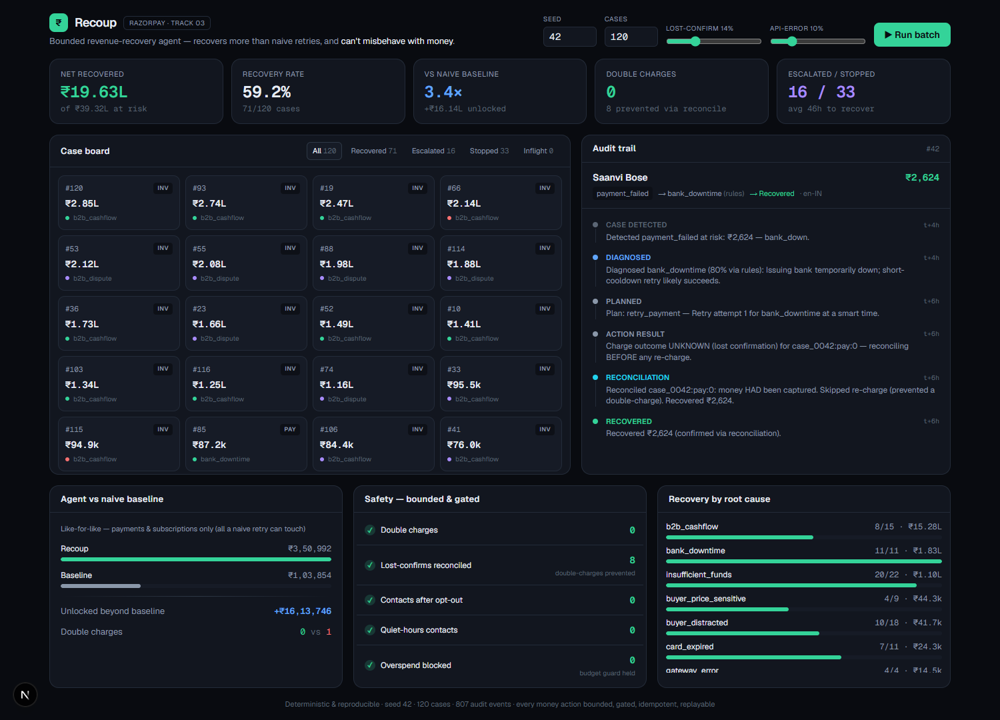
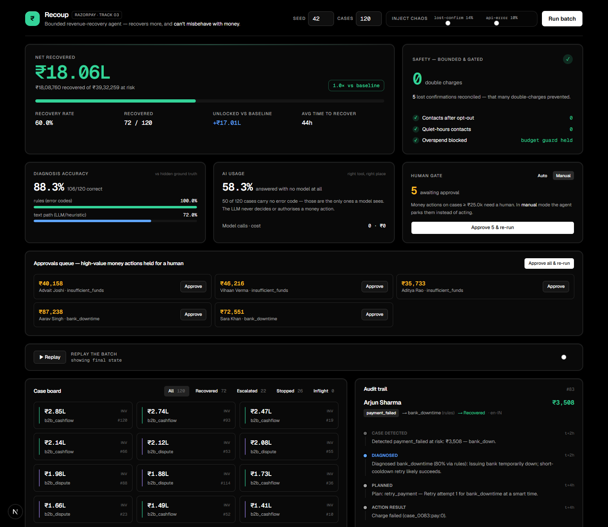

# Recoup — a bounded revenue-recovery agent

[](https://github.com/shubhambhattog/recoup/actions/workflows/ci.yml)

**Razorpay AI Buildathon · Track 03 — AI Revenue Recovery**

> Recoup recovers **more** money than naive retries, and it **cannot** misbehave
> with money — every action is bounded, gated, idempotent, and auditable.

Recoup detects revenue at risk (failed payments, failed subscriptions, abandoned
checkouts, overdue B2B invoices), diagnoses the root cause, chooses the right
intervention, and executes a **bounded** recovery workflow on Razorpay test-mode
APIs — then reports **measured money recovered across a batch**, with a full audit
trail, compliant escalation, and stopping rules.



---

## The evidence

Not one lucky batch — **50 independent seeds, 6,000 cases**, every run
reproducible from its seed (`npm run sweep`):

| Metric (50 seeds × 120 cases) | Mean ± SD | Range |
| --- | --- | --- |
| Recovery rate | **61.9% ± 4.2%** | 51.7% – 70.0% |
| Net recovered per batch | ₹15.4L ± ₹4.9L | ₹6.1L – ₹27.8L |
| Uplift vs naive baseline (pooled, like-for-like) | **6.38×** | median per-seed 7.83× |
| Diagnosis accuracy vs hidden ground truth | **92.3% ± 2.2%** | rules path 100%, text path 79.4% |
| **Double charges** | **0** | **0 in every one of 6,000 cases** |
| Contacts after opt-out · quiet-hours contacts | **0 · 0** | 0 in every run |
| Runs where the baseline beat us | **0 of 50** | |

And the conclusions don't depend on our chosen failure rates — as the world gets
4× more hostile, recovery holds and double-charges stay at zero while the
reconciliation machinery visibly does more work:

| lost-confirm | api-error | recovery | uplift | reconciliations | double charges |
| --- | --- | --- | --- | --- | --- |
| 0% | 0% | 62.7% | 8.02× | 0.0 | **0** |
| 14% | 10% | 63.6% | 8.38× | 7.7 | **0** |
| 50% | 40% | 63.6% | 12.98× | 24.8 | **0** |

A single batch (seed 42, 120 cases) in detail: **₹39.3L at risk → ₹19.0L net
recovered (74/120)**, 3.4× the baseline like-for-like plus **₹15.6L unlocked**
from carts and invoices the baseline can't touch, **0 double-charges** with 5
lost confirmations reconciled, and a **1,000-event replayable ledger**.

Every assumption behind these numbers is documented in
**[`SIMULATION.md`](SIMULATION.md)** — including what we are *not* claiming.

```bash
npm install
npm run recover:batch     # one batch: full scorecard + audit ledger
npm run sweep             # 50 seeds + sensitivity (fails if any run double-charges)
npm test                  # fuzzed guardrail invariants across random policies
npm run eval:diagnosis    # diagnosis graded against hidden ground truth
npm run dev               # dashboard at http://localhost:3000
```

No API keys required for any of the above — the whole measured pipeline runs
offline and deterministically.

---

## Why this is the honest version

Any recovery demo can show one lucky success. The Track 03 bar explicitly rejects
that (*"one cherry-picked match proves nothing"*). So:

- **The agent never sees ground truth.** Each case has a hidden persona deciding
  whether the customer will actually pay, when, and what it takes. A wrong
  diagnosis or a mistimed retry genuinely fails. We then *grade our own
  diagnosis* against that truth — and report that the text-only path gets **72%**
  right, not 100%.
- **Like-for-like comparison.** The naive baseline can only retry payments, so
  comparing totals would flatter us. We report the payments-and-subscriptions
  comparison (**6.38× pooled**) and the money unlocked beyond it *separately*.
- **Distributions, not point estimates.** Mean ± SD across 50 worlds, plus a
  sensitivity sweep over the assumptions themselves.
- **An exception list, not just wins.** Every case Recoup can't resolve is
  reported with its reason.

## The recovery loop

```
  DETECT ─▶ DIAGNOSE ─▶ DECIDE ─▶ [GATE] ─▶ ACT ─▶ OBSERVE ─┐
    ▲                                                        │
    └──────────────── loop until recovered ─────────────────┘
                       or a STOPPING RULE fires
                  (recovered · escalated · max attempts
                   · past deadline · opted out · awaiting human)
```

## AI judgment: the right tool, and where we chose *not* to use one

The LLM is deliberately kept **out of the money-authorization path**. It does
exactly two things, both genuine language/ambiguity tasks:

1. **Classify** the root cause of behavioural, text-only cases (an abandoned
   cart, a disputed invoice) — never a case whose Razorpay error code already
   answers it. **58% of cases never reach a model at all.**
2. **Compose** the customer message (Hinglish where the customer's locale is
   `hi-IN`).

Every decision that moves or spends money — whether to retry, when, how much
incentive, escalate vs stop — is **deterministic policy + guardrails**.

We measure this rather than asserting it. `npm run eval:diagnosis` scores each
classifier against hidden ground truth on identical cases (seed 42, 120 cases):

| Classifier | Overall | Rules path | **Text path** | Money behind wrong calls | Cost |
| --- | --- | --- | --- | --- | --- |
| rules + offline heuristic | 88.3% | **100%** | 72.0% | ₹4,25,989 | ₹0 |
| rules + **Gemini 3.7 Flash** | **93.3%** | **100%** | **84.0%** | **₹19,645** | ₹1 (50 calls) |

The deterministic rules are perfect on structured Razorpay errors — a model adds
nothing there, which is exactly why we don't call one. The *text* path is where
it earns its place: **+12 accuracy points, and ₹4.06L less money sitting behind a
wrong call, for ₹1 of model spend.** Gemini eliminates the heuristic's worst
confusion — reading likely bad debt as a recoverable cashflow delay.

That flows straight through to money, because a better diagnosis means less
wasted chasing:

| Seed 42 batch | offline heuristic | + Gemini 3.7 Flash |
| --- | --- | --- |
| Gross recovered | ₹19,07,364 | **₹20,39,558** |
| Intervention cost | ₹2,552.60 | **₹993.55** (−61%) |
| AI cost | ₹0 | ₹1 |
| **Net recovered** | ₹19,04,811 | **₹20,38,563** (**+₹1,33,752**) |

It recovers one *fewer* case and ₹1.32L *more* money — because it correctly gives
up on the dead ones and spends the effort where it pays. **₹1 of AI returned
₹1.34L of net recovery.**

The headline metrics elsewhere in this README are the **offline** ones: they are
deterministic, free, and reproducible on a fresh clone. The LLM figures above are
a measured enhancement (a model call is non-deterministic, so re-running may vary
by a point or two), reported separately rather than blended into the headline.

The LLM layer is **provider-agnostic** (defaults to Gemini, one env var to swap):

```bash
# .env.local
GEMINI_API_KEY=...            # https://aistudio.google.com/apikey
# LLM=1                        # enable the model inside batch/eval
# AI_GATEWAY_API_KEY=... + LLM_MODEL=openai/gpt-4o   # or any provider
npm run llm:smoke             # verify your key
```

## Bounded & gated: why it can't misbehave with money

The guardrail layer is the last thing between a plan and a money action:

- **Idempotency** — every charge / Payment Link carries an idempotency key
  (`reference_id`); money moves at most once per key.
- **Reconciliation before re-charge** — a lost confirmation is checked against
  the source of truth before any retry. **This is the on-camera failure.**
- **Caps & cooldowns** — max money attempts, max contacts, per-customer daily
  cap, cooldown between retries.
- **RBI-aligned quiet hours** — no contact outside 08:00–19:00 local, per RBI's
  recovery-agent guidelines (12 Aug 2022). Opt-out halts everything, forever.
- **Spend caps** — per-case and batch-wide incentive budget.
- **A real human gate** — money actions on high-value cases park as
  `awaiting_human` until approved. Toggle **Human gate: manual** in the dashboard:
  5 actions worth ₹35k–₹87k stop dead, net recovery drops ₹19.05L → ₹18.06L, and
  only a human clicking Approve releases them (net returns to ₹19.05L). The gate
  costs money on purpose — that is what makes it a gate.



These aren't claims — `npm test` fuzzes randomized policies and chaos across many
seeds and asserts every invariant, and CI fails the build if any run
double-charges.

All of it lands in an **append-only ledger** — every decision and money action
with its reasoning, replayable end to end (`artifacts/ledger.jsonl`). The
dashboard can **replay the whole batch over virtual time** — press ▶ and watch
cases move through the pipeline.

## Razorpay test-mode integration

The loop runs behind an `Executor` interface, so the same decision engine drives
either the simulator (for measured metrics) or **real Razorpay test-mode APIs**:

```bash
# .env.local → RAZORPAY_KEY_ID=rzp_test_…  RAZORPAY_KEY_SECRET=…
npm run razorpay:demo     # one link: create → prove idempotency → reconcile
npm run razorpay:live     # a live mini-batch driven by the real decision loop
```

`npm run razorpay:live` runs the actual pipeline (diagnose → policy → gate →
execute) against Razorpay, creating real test-mode Payment Links idempotently and
reconciling their live status — refusing to run at all if it detects a live key.
There's also a signature-verified **webhook receiver** at
`/api/razorpay/webhook` (`payment_link.paid`, `payment.captured`), so recovery
can be *observed* event-driven rather than polled. In the dashboard, any case
offers **"Create real Razorpay recovery link"**. Without keys, everything
degrades gracefully.

## Project structure

```
src/
  lib/
    core/        rng (seeded), money (paise), time (virtual clock), env
    domain/      types, policy config (all bounds, with regulatory citations)
    ledger/      append-only audit ledger
    engine/      diagnose · policy · guardrails · loop · executor · baseline · run
    sim/         world (hidden ground truth + chaos) · generate (synthetic batch)
    ai/          provider-agnostic LLM (Gemini default) behind a narrow interface
    razorpay/    test-mode client wrapper
    metrics/     report · diagnosis scoring
  app/           dashboard + /api/run + /api/razorpay/{link,webhook}
  scripts/       run-batch · sweep · eval-diagnosis · razorpay-demo · razorpay-live-batch
  tests/         guardrail fuzz suite + engine tests
```

## Docs

- **[`SIMULATION.md`](SIMULATION.md)** — every assumption, what's grounded in
  regulation, and how we de-risked the rest.
- **[`ARCHITECTURE.md`](ARCHITECTURE.md)** — the deep dive.
- **[`FAILURE_STORY.md`](FAILURE_STORY.md)** — what broke and how I got out.

## Tech stack

Next.js 16 (App Router) · TypeScript · Tailwind v4 · shadcn/ui · Vercel AI SDK
(Gemini via `@ai-sdk/google`, provider-agnostic) · Razorpay Node SDK (test mode) ·
`node:test` · GitHub Actions. No database — the ledger is append-only JSONL, so a
reviewer can clone and reproduce every number.
